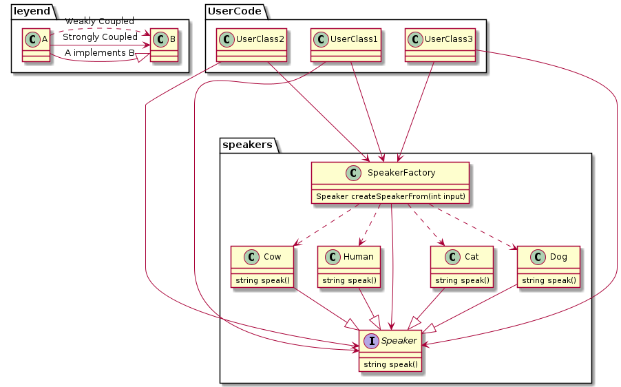

# Strategy pattern + Factory pattern in C++

## What is this?

This repository contains an experimental example to practice design patterns and polymorphism with C++.

The initial idea was to contain conditional code as much as possible to minimize the indeterminate states within a growing codebase by using polymorphism.

As with most things in life, things are better understood when reduced to the point in which a 5-year old can understand.

That is why we are using animals.

## How to run?

0. Install cmake.
1. Clone this repository.
2. `cd` into it.
3. `mkdir build && cd build && cmake .. && make`
4. Run it: `./test`

